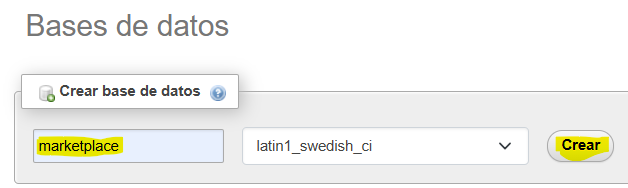
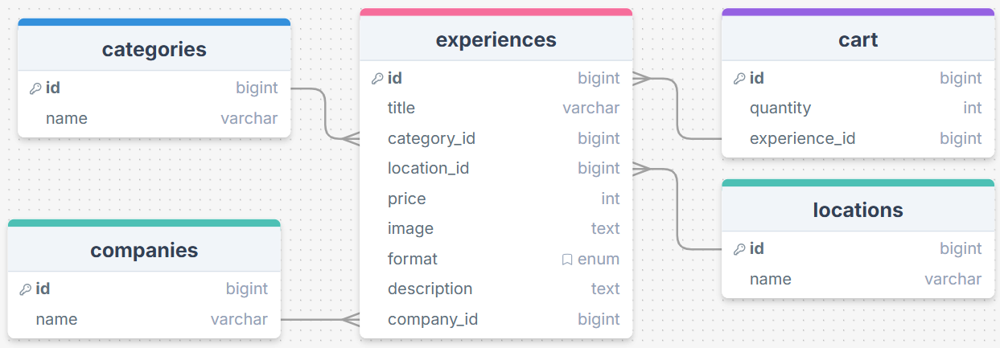

# ArtPrint 🎨

## 💡 Descripción

ArtPrint consiste en un marketplace de talleres y cursos de manualidades, en el que podrás conectar con instructores especializados en diversas técnicas de arte y manualidades tanto en presencial como online u híbrido.

Este repositorio incluye la parte del backend de la aplicación, donde está desarrollada la API con todas las funcionalidades necesarias para que instructores publiquen sus talleres, los usuarios se inscriban, etc.

[Repositorio del frontend](https://github.com/Akalchi/marketplaceArtPrint)

## ❓ Requerimientos de instalación

Para poder probar este proyecto en local necesitarás:

1. XAMPP (o cualquier otro servidor local que soporte PHP y MySQL)

2. Terminal del Sistema Operativo

3. Instalar Composer

4. Instalar NPM via Node.js

5. Xdebug (para poder ver el test coverage)

6. Postman (o cualquier otra plataforma para usar la API, como Insomnia)

## 💻 Instalación

1. Clonar el repositorio:
```
    git clone https://github.com/haydeemarianne/ArtPrint.git
```

2. Instalar las dependencias de Composer:
```
    composer install
```

3. Instalar las dependencias de NPM:
```
    npm install
```

4. Crear un archivo '.env' tomando de ejemplo el archivo '.env.example' y modificar las líneas:
    - DB_CONNECTION=mysql
    - DB_DATABASE=marketplace

5. Crear una base de datos en MySQL vacías (aquí hemos usado *phpMyAdmin*)


6. Generar todas las tablas y valores falsos:
```
    php artisan migrate:fresh --seed
```

7. Correr NPM:
```
    npm run dev
```

8. Correr Laravel (en otra terminal):
```
    php artisan serve
```

Con todo esto será posible usar la API del proyecto con la URL que nos genere este último comando:

## 📚 Diagrama de la base de datos

Este es el diagrama de la base de datos para este proyecto. Tenemos cinco tablas, **Companies**, **Categories**, **Locations**, **Experiences** y **Cart**, con sus respectivas relaciones.



## 🔍 API Endpoints

-------
-------

## 🛠️ Tecnologías y Herramientas del backend

<a href='https://github.com/shivamkapasia0' target="_blank"></a>
<a href='https://github.com/shivamkapasia0' target="_blank"></a>
<a href='https://github.com/shivamkapasia0' target="_blank"></a>
<a href='https://github.com/shivamkapasia0' target="_blank"></a>

<a href='https://github.com/shivamkapasia0' target="_blank"></a>
<a href='https://github.com/shivamkapasia0' target="_blank"></a>
<a href='https://github.com/shivamkapasia0' target="_blank"></a>
<a href='https://github.com/shivamkapasia0' target="_blank"></a>

## 👨🏻‍💻 Team

Este proyecto ha sido desarrollado para la Hackathon 2025 de Factoría F5 por parte de:

- [Stefano Emanuel Micciche](https://github.com/StefanoMicciche)
- [José Manuel Barreiro Álvarez](https://github.com/jomabal98)
- [Ariana Martín Martínez](https://github.com/ArianaMartinMartinez)
- [Marianne Cedeño Rojas](https://github.com/haydeemarianne)
- [Eva Sisalli Guzmán](https://github.com/miskybox)
- [Alejandra Fernández Viña](https://github.com/Akalchi)
- [Mariona Cuyàs Paulano](https://github.com/cuyass)
- [Thais Intxaurtieta](https://github.com/intxaurtietadev)